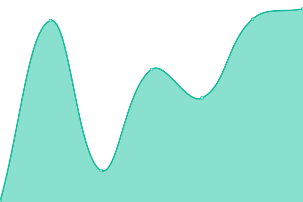

# [📈 Live Status](https://Javier-Jimenez99.github.io/tr3cks-webmonitor): <!--live status--> **🟩 All systems operational**

This repository contains the open-source uptime monitor and status page for [Javier Jiménez de la Jara](https://javier-jimenez99.github.io/Portfolio/), powered by [Upptime](https://github.com/upptime/upptime).

With [Upptime](https://upptime.js.org), you can get your own unlimited and free uptime monitor and status page, powered entirely by a GitHub repository. We use [Issues](https://github.com/Javier-Jimenez99/tr3cks-webmonitor/issues) as incident reports, [Actions](https://github.com/Javier-Jimenez99/tr3cks-webmonitor/actions) as uptime monitors, and [Pages](https://Javier-Jimenez99.github.io/tr3cks-webmonitor) for the status page.

<!--start: status pages-->
<!-- This summary is generated by Upptime (https://github.com/upptime/upptime) -->
<!-- Do not edit this manually, your changes will be overwritten -->
<!-- prettier-ignore -->
| URL | Status | History | Response Time | Uptime |
| --- | ------ | ------- | ------------- | ------ |
|  [App Frontend (React)](https://animdle.com) | 🟩 Up | [app-frontend-react.yml](https://github.com/Javier-Jimenez99/tr3cks-webmonitor/commits/HEAD/history/app-frontend-react.yml) | 

 712ms
     
 | 

<a href="https://Javier-Jimenez99.github.io/tr3cks-webmonitor/history/app-frontend-react">100.00%</a>
    

|  [API Backend (Django)](https://api.animdle.com/health/) | 🟩 Up | [api-backend-django.yml](https://github.com/Javier-Jimenez99/tr3cks-webmonitor/commits/HEAD/history/api-backend-django.yml) | 

 552ms
     
 | 

<a href="https://Javier-Jimenez99.github.io/tr3cks-webmonitor/history/api-backend-django">100.00%</a>
    

|  [EasyUpscaler](https://easyupscaler.net) | 🟩 Up | [easy-upscaler.yml](https://github.com/Javier-Jimenez99/tr3cks-webmonitor/commits/HEAD/history/easy-upscaler.yml) | 

 755ms
     
 | 

<a href="https://Javier-Jimenez99.github.io/tr3cks-webmonitor/history/easy-upscaler">99.70%</a>
    

<!--end: status pages-->

[**Visit our status website →**](https://Javier-Jimenez99.github.io/tr3cks-webmonitor)

## 📄 License

- Powered by: [Upptime](https://github.com/upptime/upptime)
- Code: [MIT](./LICENSE) © [Anand Chowdhary](https://anandchowdhary.com), supported by [Pabio](https://pabio.com)
- Data in the `./history` directory: [Open Database License](https://opendatacommons.org/licenses/odbl/1-0/)
